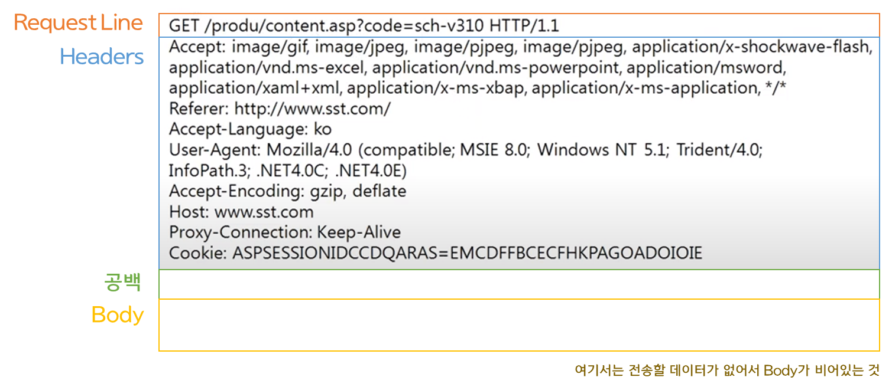
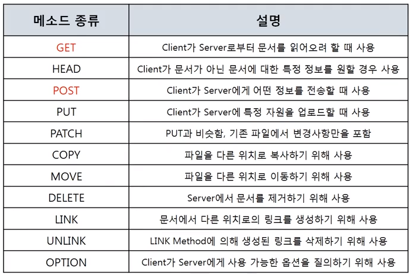

# HTTP와 HTTPS

## 💜 HTTP(Hyper Text Transfer Protocol)

- 서버와 클라이언트 간에 데이터를 주고 받는 규칙을 정의한 프로토콜(80번 포트)이다.
- Web에서 실행할 HTML, JavsScript, CSS 등의 데이터를 서버에 요청하고 받아오는 데 사용되는 프로토콜이다.
- Request/Response(요청/응답) 동작에 기반하여 서비스를 제공한다.

## 💜 HTTP 요청 프로토콜

- 요청하는 방식을 정의하고, 클라이언트의 정보를 담고있다.
- Request Line > Headers > (공백) > Body로 이루어져 있다.
  
  - Request Line ⇒ [**요청 타입** > (공백) > **URI** > (공백) > **HTTP 버전**]
    - GET, POST를 일반적으로 사용하고, 나머지 메소드는 보안 상 막아두는 경우가 많다. (클라이언트에서 서버의 데이터를 직접 수정X)
    - GET은 데이터를 URI에 포함해서 보내고, POST는 Body에 포함해서 보낸다.
      데이터가 노출되어도 되는지에 따라 결정된다고 볼 수 있으나, Body의 내용도 결국은 볼 수 있기 때문에 HTTPS를 이용해야 한다.
    

## 💜 HTTPS(Hyper Text Transfer Protocol Secure)

- HTTP는 암호화 되지 않은 평문 데이터를 전송하는 프로토콜이기 때문에, 누군가 네트워크 신호를 가로채면 HTTP의 내용이 그대로 외부에 노출된다.
- 고객의 개인정보나 비밀을 취급하는 서비스라면 큰 보안적 문제가 될 수 있는데, 이런 문제를 해결하기 위해 등장한 것이 **HTTPS**이다.
- HTTPS는 HTTP에 데이터 암호화가 추가된 프로토콜(443번 포트)이다.
- 브라우저 주소창에 자물쇠 표시로 HTTPS가 적용되었다는 것을 알 수 있다.
- 처음에는 전자상거래 등 고객의 중요 정보를 다루는 사이트 위주로 사용되었으나, 2014년 구글에서 HTTP를 HTTPS로 변환하라고 권고했고, HTTPS를 적용하는 사이트에는 SEO(검색엔진 최적화)에 가산점을 주었다.
- 또한, HTTPS가 아닐 때 주의 요함 등의 경고 문구가 뜨는데 이는 사용자 입장에게 불안감을 느끼게 할 수 있도 있는 부분인 것 같다.
- 기존의 HTTP는 네트워크 전송계층의 TCP 위에서 동작한다.
- HTTPS는 SSL(Secure Sockets Layer)라는 보안계층 위에 HTTP를 얹어서 보안이 보장된 통신을 하는데 이 통신 방식을 SSL 암호화 통신이라고 한다. SSL 암호화 통신은 공개키 암호화 방식의 알고리즘을 통해 구현된다.

🤗 참고

[HTTP vs HTTPS의 차이점을 알아보자](https://devjem.tistory.com/3)

[따라하면서 배우는 IT - 네트워크 기초 11](https://www.youtube.com/watch?v=TwsQX1AnWJU&list=PL0d8NnikouEWcF1jJueLdjRIC4HsUlULi&index=28)
